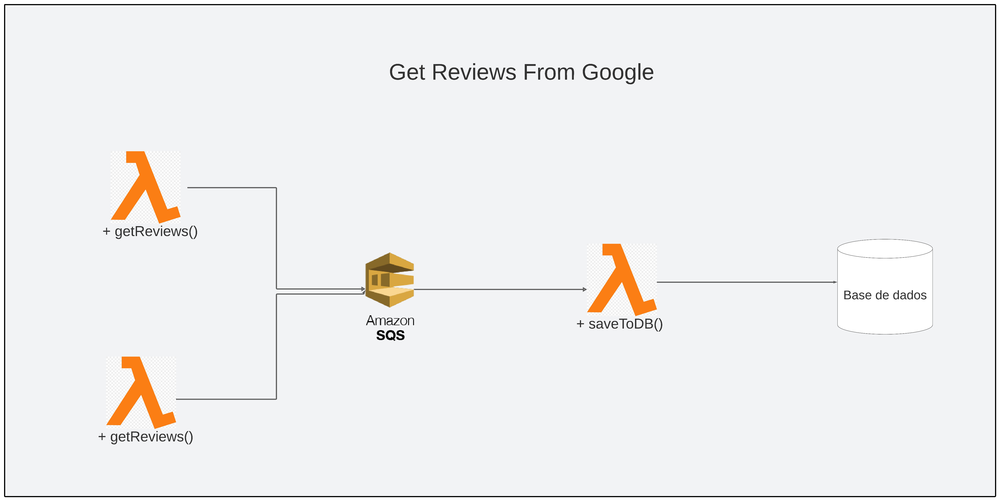

# Google Review Scrape from Places API on AWS

<div>
  
</div>

## Objetivo

O objetivo deste projeto é fornecer um mecanismo para coletar e armazenar reviews de clientes de locais comerciais. As reviews podem ser usadas para melhorar a experiência dos clientes, identificar oportunidades de melhoria e gerar insights sobre o mercado.

## Descrição

Este projeto faz scraping das reviews do Google a partir de um determinado `place_id` para um banco de dados PostgreSQL. O scraping é feito por meio de uma função AWS Lambda que é executada a cada 10 minutos. A função Lambda então envia as reviews para uma fila AWS SQS. Uma outra função Lambda consome as reviews da fila e as salva no banco de dados PostgreSQL.

Este projeto usa a API do `Google Places` para retornar as reviews dos locais comerciais. A API do `Google Places` é uma API RESTful que fornece acesso aos dados do Google Maps, incluindo reviews de locais comerciais.

Para usar a API do Google Places, você precisará de um ID do cliente e uma chave de API. Você pode obter um ID do cliente e uma chave de API criando uma conta no Google Cloud Platform.

No código do projeto, você precisará definir as variáveis de ambiente GOOGLE_CLIENT_ID e GOOGLE_API_KEY com o seu ID do cliente e chave de API.

Para saber mais:

- Sobre como achar o `place_id` de um estabelecimento, vá para [esta página](https://developers.google.com/maps/documentation/places/web-service/place-id) e insira o nome do estabelecimento.
- Sobre a api do `Google Places`, [veja a documentação](https://developers.google.com/maps/documentation/places/web-service/details)

### Requerimentos

* Node.js
* npm which comes with Node.js
* docker

### Rodando o projeto

Instale as dependências:

```
$ npm install
```

Suba os containers necessários com docker-compose:

```
$ docker-compose up -d
```

E então execute o projeto no modo de desenvolvimento:

```
$ npm run dev
```

### Uso

O evento de cron está desativado mas uma requisição GET na rota /producer ativa a lambda

*Producer*

```
GET /producer
```

```json
{"message": "[${id}] - Reviews sent to SQS!"}
```

Após isso, é possível verificar a inclusão dos dados em uma tabela dinâmica usando o `pgadmin`

### Melhorias

- [] Utilizar a api do [Google Business](https://developers.google.com/my-business/reference/rest/v4/accounts.locations.reviews#Review) para obter todas as reviews de um estabelecimento
- [] Implementar lógica para não salvar reviews duplicadas no banco
- [] Melhorar lógica para queries do postgresql
- [] Implementar testes
